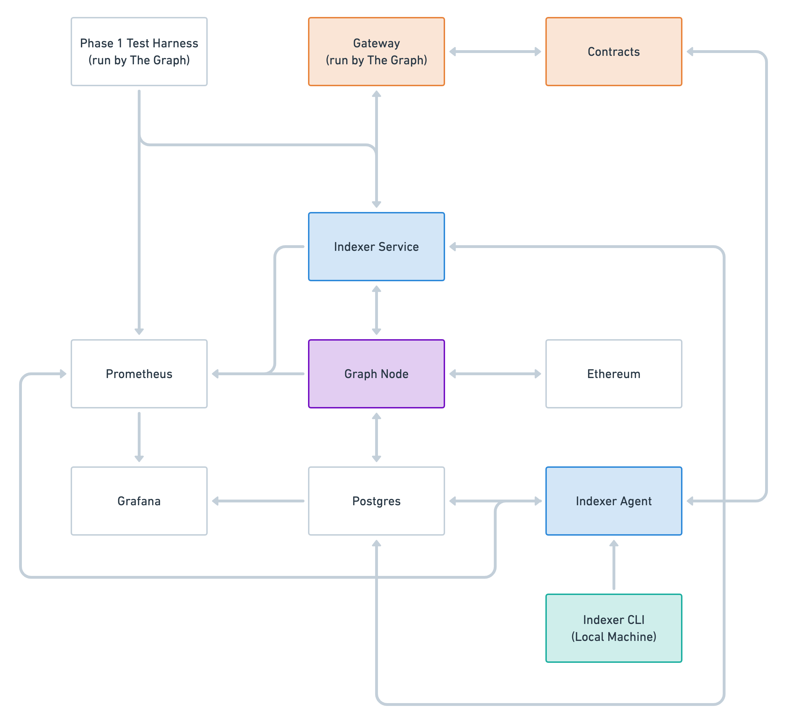

# Mission Control: Indexer Material

Technical indexer documentation and infrastructure templates for the Mission Control testnet.

For support, please join the `#indexers` channel on [our
Discord](https://thegraph.com/discord). The Graph team will be happy to
assist you in getting set up.

## Workshops

- Indexer Workshop (August 4th) [[Slides](./files/indexer-workshop.pdf), [Video](https://www.youtube.com/watch?v=zRiJ_Q3EPH8)]

## Resources

- [FAQ](./faq.md)
- [Community Wiki](https://github.com/graphprotocol/mission-control-indexer/wiki) (please edit responsibly!)
- [Guides](./guides/README.md)

# Past Phases

- [Phase 0](phases/phase0.md)

# Phase 1: Basic Protocol Actions

Phase 1 is divided into two missions:

1. Set up indexer components
2. Perform basic protocol actions

## Important Updates

- 2020-08-27: [Indexer Agent and CLI bugfix
  releases](./updates/2020-08-27-bugfix-releases.md) — properly detect
  on-chain registration and service status.
- 2020-08-27: [Indexer CLI status
  improvements](./updates/2020-08-27-status-improvements.md) — detailed status
  reports for endpoints, with troubleshooting help.

## Mission 1: Set up Indexer Components

To prepare for the second mission of phase 1, indexers will need to extend
their infrastructure to include components that will facilitate their
interactions with the network and help manage subgraph deployments. Two
components will be added to the indexer infrastructure: `indexer-agent` and
`indexer-service`. Please refer to the following documentation for help
setting up for phase 1.



### Indexer Agent

The Indexer Agent automatically chooses which subgraphs to index and manages
deploying subgraphs to the indexer's Graph Node(s), allocating stake,
claiming rewards, and setting real-time query prices on indexed subgraphs.
Using flexible rules and the Indexer CLI (see below), one can
configure automatic behavior and also make manual subgraph indexing
decisions. The Indexer Agent monitors The Graph Network as well as the
Indexer's own infrastructure to implement the strategy that has been defined
by the Indexer.

- [Source code](https://github.com/graphprotocol/indexer/)
- [NPM package](https://testnet.thegraph.com/npm-registry/-/web/detail/@graphprotocol/indexer-agent)
- [Docker image](https://hub.docker.com/repository/docker/graphprotocol/indexer-agent) (tag: `sha-54d4905`)

### Indexer Service

The Indexer Service is the indexer's public API in the network. It exposes a
public query endpoint, proxies part of the Graph Node's indexing status API,
manages state channels for receiving query payments, and will, in the future,
help to facilitate disputes that arise.

- [Source code](https://github.com/graphprotocol/indexer/)
- [NPM package](https://testnet.thegraph.com/npm-registry/-/web/detail/@graphprotocol/indexer-service)
- [Docker image](https://hub.docker.com/repository/docker/graphprotocol/indexer-service) (tag: `sha-54d4905`)

### Indexer CLI

This connects to port 8000 of the Indexer Agent, which serves the so-called
indexer management API. The CLI can be used to control the behavior of the
Indexer Agent.

- [NPM package](https://testnet.thegraph.com/npm-registry/-/web/detail/@graphprotocol/indexer-cli)
- [Guide: Indexer Management using Indexer Agent and CLI](./guides/indexer-management.md)

### Example infrastructure

- [Kubernetes manifests](./k8s/) — The k8s manifests in the example
  setup have been updated to include `indexer-agent` and
  `indexer-service` deployments. The `indexer-service` is also included
  in the ingress for exposing it to the network.

### NPM Registry Access

For the testnet, we operate a private NPM registry at
https://testnet.thegraph.com/npm-registry/. Since at least the indexer CLI
requires access to the NPM registry, make sure you've got that set up
properly:

```sh
npm set registry https://testnet.thegraph.com/npm-registry/
npm login
```

If you build your own Docker images, you will have to obtain the NPM auth
token from `~/.npmrc` and store it in an environment variable:

```sh
$ cat ~/.npmrc | grep authToken
//testnet.thegraph.com/:_authToken=<NPM_TOKEN>
```

Use the `<NPM_TOKEN>` part as the `NPM_TOKEN=...` that you pass to Docker in
the later steps.

### Installation

The `indexer-agent` and `indexer-service` each require configuration
parameters to connect to Ethereum, other parts of the indexer's
infrastructure (Graph Node(s), Postgres) and to communicate with the network.

These may be applied as CLI arguments (detailed below) or as environment
variables prefaced with the component name and formatted in all caps. The
indexer-service `--ethereum` argument for example becomes
`INDEXER_SERVICE_ETHEREUM`.

Note: Some environment variables for the `indexer-service` are not prefixed
with `INDEXER_SERVICE`. These are:

- `SERVER_HOST`,
- `SERVER_PORT`,
- `SERVER_DB_NAME`,
- `SERVER_DB_USER`, and
- `SERVER_DB_PASSWORD`.

The Indexer Agent and Service may be installed differently depending on your
preference and existing infrastructure. See instructions for installing via
NPM, Docker, or directly from source below.

- Using NPM:

  ```
  npm install -g \
    --registry https://testnet.thegraph.com/npm-registry/ \
    @graphprotocol/indexer-agent \
    @graphprotocol/indexer-service

  graph-indexer-agent start \
      --graph-node-query-endpoint http://localhost:8000/ \
      --graph-node-admin-endpoint http://localhost:8020/ \
      --graph-node-status-endpoint http://localhost:8030/graphql \
      --public-indexer-url http://your.indexer.domain/ \
      --indexer-management-port 18000 \
      --indexer-geo-coordinates <indexer-lat-long-coordinates. Eg: 37.630768 -119.032631> \
      --postgres-host <postgres-host> \
      --postgres-port 5432 \
      --postgres-database <indexer-service-database>
      --postgres-username <postgres-username> \
      --postgres-password <postgres-password> \
      --index-node-ids default \
      --network-subgraph-endpoint https://api.thegraph.com/subgraphs/name/graphprotocol/graph-network-rinkeby \
      --ethereum https://eth-rinkeby.alchemyapi.io/jsonrpc/demo/ \
      --mnemonic <Ethereum mnemonic>

  export SERVER_HOST=<postgres-host>
  export SERVER_PORT=<postgres-port>
  export SERVER_DB_NAME=<postgres-db> # Don't use the same as your Graph Node(s)!
  export SERVER_DB_USER=<postgres-username>
  export SERVER_DB_PASSWORD=<postgres-password>

  graph-indexer-service start \
      --port 80 \
      --graph-node-query-endpoint http://localhost:8000/ \
      --graph-node-status-endpoint http://localhost:8030/graphql \
      --network-subgraph-endpoint https://api.thegraph.com/subgraphs/name/graphprotocol/graph-network-rinkeby \
      --ethereum https://eth-rinkeby.alchemyapi.io/jsonrpc/demo/ \
      --mnemonic <Ethereum mnemonic> # This must be the same as the Indexer Agent!
  ```

- Using Docker:

  ```
  # Run indexer agent
  # Note: This assumes a `graph-node` is accessible on localhost with the admin endpoint on port 8020 and status endpoint on port 8030.
  docker run \
    -p 8000:8000 \
    -p 8020:8020 \
    -p 8030:8030 \
    -p 18000:18000 \
    -it graphprotocol/indexer-agent:sha-c87bf0f \
    ...env vars...

  # Run indexer service
  docker run \
     -p 7600:7600 \
     -it graphprotocol/indexer-service:sha-c87bf0f \
    ...env vars...
  ```

- Installing from source:

  ```
  git clone https://github.com/graphprotocol/indexer
  cd indexer
  yarn

  cd packages/indexer-service
  npm install -g

  cd ../indexer-agent
  npm install -g

  # Run indexer components
  graph-indexer-agent start ...
  graph-indexer-service start ...
  ```

### Successful Completion

Submit the following details using the [Mission Control 1 - Phase 1
Endpoints](https://airtable.com/shrTnJukfu2jArJnN) form.

1. In order to complete mission 1, you are asked to install the Indexer CLI,
   connect it to your Indexer agent, and run its `graph indexer status` command:

```sh
npm install -g \
  --registry https://testnet.thegraph.com/npm-registry/ \
  @graphprotocol/graph-cli@0.19.0-alpha.0 \
  @graphprotocol/indexer-cli

graph indexer connect http://<indexer-agent-host>:<indexer-management-port>/
graph indexer status
```

Currently this library uses libsecret so you may need to install it before running npm install.
Depending on your distribution, you will need to run the following command:
```
Debian/Ubuntu: sudo apt-get install libsecret-1-dev
Red Hat-based: sudo yum install libsecret-devel
Arch Linux: sudo pacman -S libsecret
```
2. Send us the output of this command via the form linked above.
3. Configure your Prometheus so it scrapes metrics from the Indexer Service (note: we'll add metrics for the Indexer Agent in phase 2).
4. If the Prometheus endpoint has changed since phase 0, submit the
   Prometheus endpoint through the form as well.

## Mission 2: Performing Basic Protocol Functions

Stay tuned for details!
