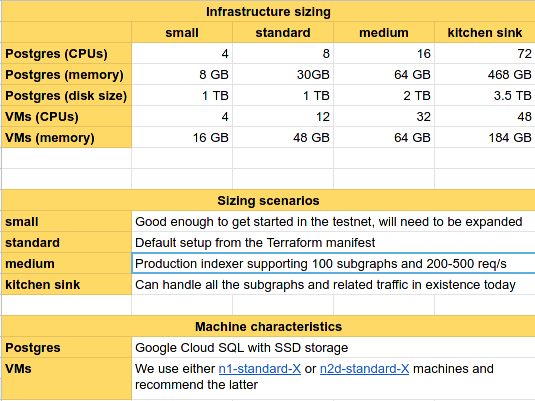

# Mission Control: Indexer Material

Technical indexer documentation and infrastructure templates for the Mission Control testnet.

For support, please join the `#indexers` channel on [our
Discord](https://thegraph.com/discord). The Graph team will be happy to
assist you in getting set up.

## Workshops

- Indexer Workshop (August 4th) [[Slides](./files/indexer-workshop.pdf), [Video](https://www.youtube.com/watch?v=zRiJ_Q3EPH8)]

## Resources

- [FAQ](./faq.md)
- [Community Wiki](https://github.com/graphprotocol/mission-control-indexer/wiki) (please edit responsibly!)

## Phase 0: Run an Indexer

In this phase indexers are asked to set up basic indexer infrastructure. This
infrastructure will then be extended upon in phase 1. The infrastructure
required for phase 0 includes:

- Graph Node
- Postgres database
- Prometheus


### The Mission

The mission is to set up the above infrastructure and index a specific set of
subgraphs. The following documentation is provided to help with this mission:

Example infrastructure:

- [Terraform infrastructure template](./terraform/)
- [Kubernetes manifests](./k8s/)

Graph Node:

- [README](https://github.com/graphprotocol/graph-node/)
- [Docker image](https://hub.docker.com/r/graphprotocol/graph-node)
- [Environment variables](https://github.com/graphprotocol/graph-node/tree/master/docs/environment-variables.md)

Configuration hints:

- Resource guidance:

  

- Access to an Ethereum mainnet archive node is required. This will enable
  you to index most of the testnet subgraphs, but not all of them. Ideal is an
  Ethereum mainnet archive node with the OpenEthereum `trace` API enabled.
- The following IPFS node is to be used when setting up Graph Node:
  https://testnet.thegraph.com/ipfs/

### Successful Completion

The following criteria must be met in order to successfully complete this
phase or mission:

1. Share a Graph Node query endpoint with The Graph.
2. Share a Prometheus endpoint with The Graph.
3. Deploy the following subgraphs to the Graph Node. These subgraphs are
   representative for all currently existing subgraphs with regards to their
   indexing effort and features used:

   ```
   Subgraph:   Moloch
   Deployment: QmTXzATwNfgGVukV1fX2T6xw9f6LAYRVWpsdXyRWzUR2H9
   Explorer:   https://thegraph.com/explorer/subgraph/molochventures/moloch
   ```

   ```
   Subgraph:   Uniswap
   Deployment: QmXKwSEMirgWVn41nRzkT3hpUBw29cp619Gx58XW6mPhZP
   Explorer:   https://thegraph.com/explorer/subgraph/uniswap/uniswap-v2
   ```

   ```
   Subgraph:   Synthetix
   Deployment: Qme2hDXrkBpuXAYEuwGPAjr6zwiMZV4FHLLBa3BHzatBWx
   Explorer:   https://thegraph.com/explorer/subgraph/synthetixio-team/synthetix
   ```

   Another subgraph that you _can_ deploy but don't have to (no bonus points),
   is listed below. It requires only a _full_ node and can be a good way to test
   your initial graph-node setup.

   ```
   Subgraph:   Gravity
   Deployment: QmbeDC4G8iPAUJ6tRBu99vwyYkaSiFwtXWKwwYkoNphV4X
   Explorer:   https://thegraph.com/explorer/subgraph/jannis/gravity
   ```

4. Serve queries for all of the above subgraphs over the shared Graph Node endpoint.
5. Serve Graph Node metrics through the shared Prometheus endpoint.
6. Serve 10 queries/second with less than 0.05% error rate for queries.

At the end of the phase, the Graph team will verify the above criteria for
all indexers participating in the testnet.

### Phase 0 Test Harness

You can find this in [testing/phase0](./testing/phase0/).

## Phase 1: Basic Protocol Actions

### Mission 1: Setting up Indexer Components

To prepare for the later mission of phase 1, indexers will need to extend their infrastructure to include components
that will facilitate their interactions with the network and help manage subgraph deployments. Two components will be 
added to the indexer infrastructer, `indexer-agent` and `indexer-service`. Please refer to the following documentation
for help setting up for phase 1. 

Indexer Agent:

- The Indexer Agent automatically makes deployment and allocation decisions. It regularly polls the network and the indexer 
infrastructure to gather data on subgraph deployments which it then uses to manage the subgraph deployments that are indexing
on its infrastructure. The subgraph deployment indexing decisions are governed by indexer rules which may be managed 
using the indexer-cli (see below.)
- [Docker image](https://registry.hub.docker.com/graphprotocol/indexer-agent)

Indexer Service:
- The Indexer Service is the indexer's public API. It exposes the public query endpoint,
proxies part of the indexing statuses API, manages state channels for query payments, and helps to facilitate any disputes that arise. 

- [Docker image](https://registry.hub.docker.com/graphprotocol/indexer-service)

Indexer CLI: 

- [README](https://github.com/graphprotocol/clis/)
- [Detailed descriptions and usage instructions](./k8s/README#Managing-subgraphs-using-the-Indexer-Agent)

Example infrastructure:

- [Kubernetes manifests](./k8s/) - The k8s manifests in the example infrastructure have been updated to include 
`indexer-agent` and `indexer-service` deployments.  The `indexer-service` deployment also includes a backend config and 
a service for exposing it to the network.

Installation:

The `indexer-agent` and `indexer-service` each require configuration parameters 
to connect to the indexer systems and communicate with the network.  These may be applied as 
startup parameters (detailed below) or as environment variables prefaced with the component name and
formatted in all caps, so the indexer-service `--ethereum` argument for example would be `INDEXER_SERVICE_ETHEREUM`.
The components may be installed differently depending on your preference and existing infrastructure, see instructions
for installing via NPM, Docker, or directly from source below. 

- Using NPM:
    ```
    npm install -g @graphprotocol/indexer-agent @graphprotocol/indexer-service
    
    graph-indexer-agent start \
        --graph-node-query-endpoint http://localhost:8000/ \
        --graph-node-admin-endpoint http://localhost:8020/ \        
        --graph-node-status-endpoint http://localhost:8030/graphql \
        --public-indexer-url http://your.indexer.domain/ \
        --indexer-management-port 18000 \
        --indexer-geo-coordinates <indexer-lat-long-coordinates> \
        --postgress-host <postgres-host> \
        --postgres-port 5432 \
        --postgres-username <postgres-username> \
        --postgres-password <postgres-password> \ 
        --network-subgraph-deployment QmdnbCVq2EKj24qCa5ibYRGAJWHdhkitTzfv8sySt6xKEa \
        --ethereum https://eth-rinkeby.alchemyapi.io/jsonrpc/demo/ \
        --mnemonic <ethereum-wallet-mnemonic>
    
    graph-indexer-service start \
        --port 80 \
        --graph-node-query-endpoint http://localhost:8000/ \
        --network-subgraph-deployment QmdnbCVq2EKj24qCa5ibYRGAJWHdhkitTzfv8sySt6xKEa \
        --ethereum https://eth-rinkeby.alchemyapi.io/jsonrpc/demo/ \
        --mnemonic <ethereum-wallet-mnemonic>
    ```
    
- Using Docker: 
    ```
    # Run indexer agent 
    # Note: This assumes a `graph-node` is accessible on localhost with the admin endpoint on port 8020 and status endpoint on port 8030. 
    docker run \
      -p 8000:8000 \
      -p 8020:8020 \
      -p 8030:8030 \
      -p 9700:9700 \
      -it indexer-agent:latest  
    
    # Run indexer service
    docker run \
       -p 7600:7600 \
       -it indexer-service:latest   
    ```
    
- Installing from source:
    ```
    git clone https://github.com/graphprotocol/indexer
    cd indexer
    yarn
    npm install -g

    # Run indexer components
    graph-indexer-agent start ...
    graph-indexer-service ...
    ```

### Mission 2: Performing Basic Protocol Functions

Stay tuned for details!