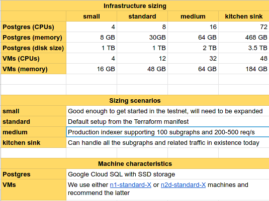

# FAQ

## Resources

### What system resources are required to participate in the testnet?



### What are the system requirements for Prometheus and Grafana?

- Prometheus doesn't need a lot of CPU. It may require up to ~1.5GB of memory
  in later phases. 200GB should be more than enough disk space for it.
- Grafana needs even less CPU, <256MB of memory and no more than 1GB of disk
  space.

### What kind of Ethereum node is required for indexing?

- A mainnet archive node will be enough to participate in the testnet.
- Ideal would be a mainnet archive node with traces. We will include
  subgraphs that require that in all phases, only those with access to the
  OpenEthereum `trace` API will be able to index these.
- Also keep in mind that for phase 0, syncing an Ethereum node may take too
  long, so plan accordingly.
- Note: Using just a single Ethereum node may in later phases limit the
  number of subgraphs you can index (due to the required I/O throughput). We
  recommend load balancing across a few nodes.

### How to configure Prometheus to scrape Graph Node metrics?

https://prometheus.io/docs/prometheus/latest/installation/ has some
instructions on installing Prometheus, as well as links to binaries. Once
Prometheus is up and running, the main difference compared to k8s is how you
configure it so that it scrapes the Graph node metrics.

Prometheus gets its metrics using so-called "scrape configs".
https://github.com/graphprotocol/mission-control-indexer/blob/master/k8s/base/prometheus.yaml#L103-L128
shows the config file using a scrape job with kubernetes_sd_configs. If you
run everything bare metal, you'll probably need to use a job with
static_configs (pointing to e.g. http://localhost:8040/ if that's the port
that your graph-node serves the metrics from). Check out
https://prometheus.io/docs/prometheus/latest/configuration/configuration/#scrape_config
and
https://prometheus.io/docs/prometheus/latest/configuration/configuration/#static_config
in particular.

## What does the `ingress.kubernetes.io/target-proxy` in the k8s setup mean?

That is only useful if you want to set up your ingress so it's accessible
through Google's global HTTPS load balancer. We found that to be the easiest
way to expose an ingress via an auto-updated SSL certificate. Without that,
all you get is a static IP address (which you can then still add a DNS entry
for, but it'll be HTTP). Which may be fine, depends on how far you want to
take it.

If you are interested in the HTTPS setup, here's a quick writeup:
https://jannis.github.io/notes/google-cloud-https.

## Phase 0

### How do I deploy phase 0 subgraphs to the Graph nodes?

**Hint:** Don't build them from the subgraph repos. That will lead to
different subgraph deployment IDs than the ones required for phase 0.

If you are using the k8s setup, all you have to do is e.g.:

```bash
# 1. Create the subgraph name
kubectl exec shell -- create "molochventures/moloch"

# 2. Deploy the expected version
kubectl exec shell -- deploy "molochventures/moloch" "QmTXzATwNfgGVukV1fX2T6xw9f6LAYRVWpsdXyRWzUR2H9" "index_node_0"
```

Otherwise it would be something like (using [HTTPie](https://httpie.org/)):

```bash
# 1. Create the subgraph name
http post <GRAPH_NODE>:8020 \
  jsonrpc="2.0" \
  id="1" \
  method="subgraph_create" \
  params:='{"name": "molochventures/moloch"}'

# 2. Deploy the expected version
http post <GRAPH_NODE>:8020 \
  jsonrpc="2.0" \
  id="1" \
  method="subgraph_deploy" \
  params:='{"name": "molochventures/moloch", "ipfs_hash": "QmTXzATwNfgGVukV1fX2T6xw9f6LAYRVWpsdXyRWzUR2H9", "node_id": "<target-node-id>"}'
```
