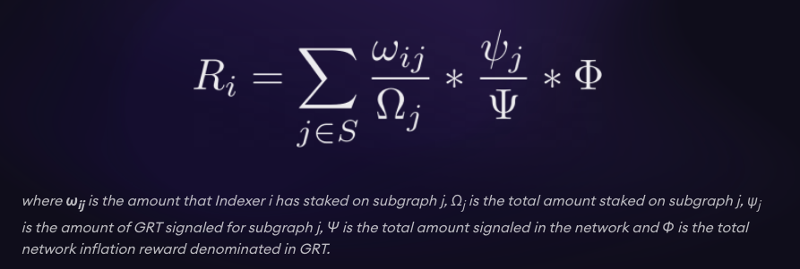

# Indexer Economics for the Testnet
We have presented documentation and videos in the past that have expressed information for the
indexers on how the economics in the protocol works. The best reference for this would be the
[Indexer Kickoff videos](https://www.youtube.com/channel/UCAzO0qviMMiEdq90B90pvGQ), as well as the 
[Curator Kickoff call](https://www.youtube.com/watch?v=sM8XBg8YkP8&feature=youtu.be&t=900).
The link for the Curator Kick Off call starts right at the economics talk for your convenience.

This document is a simple recap of the economics, with the intent to make this folder in the
mission control indexer repository more complex in regards to the economics of each Phase of
the testnet.

# Recap on Protocol Economics
We will have a short recap on the protocol economics, focused on the ways that profit can be made
in the protocol. One of the best resources for the economics is
[this blog](https://thegraph.com/blog/the-graph-network-in-depth-part-2). We will go over the main
points here

## Inflation Rewards
The inflation rewards refer to the minting of GRT in order to incentivize indexers to index subgraphs.
The formula for it can be seen below:



The basic things to grasp are:
- Subgraphs with more signal will receive more inflation rewards
- The Indexer with more stake on that subgraph will receive a larger portion of the rewards that
  the subgraph will receive

An important parameter in the testnet is the `network GRT issuance` (a.k.a inflation rate). This
parameter is very important. In the testnet so far we have used 3%, and it should stay around
this value.

An Indexer should be paying attention to the subgraphs with the most signal, as well as the most
queries, in order to maximize their return in both indexing rewards and query rebates.
We will get into queries next

## Query Fee Rebates
Queries that consumers make are paid for in GRT in state channels. These state channels then send
the GRT on chain. When allocations are closed out, these query fees get aggregated in a single pool
for each epoch. The Rebate Formula (a.k.a Cobbs-Douglas Formula) is shown below:


The formula is a bit complex. Let's add some more detail on how it works in The Graph:
- The formula only considers a single subgraphs query fees - i.e. the query rebates on one subgraph
  will not effect the query rebates on another subgraph
- The time period is always a length of one epoch. Then the calculation starts again for another epoch
- An Allocation can last across many epochs, loosely enforced by the `maxAllocationEpochs` parameter.
  epoch
- When closed, you must wait at least `channelDisputeEpochs` epochs before you can claim the 
  query fee rebate. This is known as "Settling" Query fees will go into the epoch that the allocation is closed. Note that during this time, if
  that Allocation is still recevieing query fees,
  they will be added to this epochs total query fees
- The query fees can be claimed after the `channelDisputesEpoch` time is up

When you examine the formula, you will notice that you can actually **receive fewer query fee**
**rebates than the query fees you collected**. This is shown with an example in the screen shot
below:


(build this table yourself if you would like, it is easy, and will help with intuition of the formula!)

Make sure as a indexer that you understand how the above formula works. You should ensure you are
maximizing your indexing rewards and query fee rewards according to the cobbs douglas formula.
Otherwise, the indexer agent handles most of the stuff around epochs and timing.

## Curation Bonding Curves
The curation bonding curves have already been explained in the Curator Kickoff video linked above.
That is a good reference. We have included below some other references for those that want a deeper
understanding:

- [A high level write up on Bancors bonding curves](https://medium.com/@billyrennekamp/converting-between-bancor-and-bonding-curve-price-formulas-9c11309062f5)
- [A more mathematical write up on Bancors bonding curve](https://blog.relevant.community/bonding-curves-in-depth-intuition-parametrization-d3905a681e0a)
- [A calculator with bancor parameters. Where:](https://www.desmos.com/calculator/pvxwmt9stf)
  - `k` = the reserve ratio
  - `b` = the underlying token balance (in our case, GRT)
  - `s` = the supply of the curve token (in our case, the Curation Shares)
  - Together, `b` and `s` influence the slope, `m`.
  - And `d` is just added in for illustrative purposes, tos show how much the price will increase
    to purchase `d` shares.

As an indexer, you should understand the reasons why you would want to enter a bonding curve, to
make potential profit. You should also understand the risks associated with this, often known as
being "rug pulled".

The Graph will deploy all Subgraphs for each phase. It is the job of the Indexers to decide which
subgraphs are most likely to be useful, and receive queries. It is then also their job to monitor
the actual queries being sent, when The Graph starts to send queries to each subgraph.

## Recap on Savings Rate (Testnet only)
The savings rate is something that we added into the testnet to give the option of moving your
capital outside of the protocol. We are looking to simulate the real world, in the sense that as
an indexer you could realize you could be getting a better return with your capital, and thus exit
your capital from the graph. You can [deposit in the savings contract here](https://testnet.thegraph.com/savings/).

As an Indexer, you should be able to calculate your expected APR from staking, curating, and query
fees. If you ever notice that the savings rate goes above this, it is rational for you to move your
money into the savings contract, and get a better return on investment.

## Others (Delegation & Subgraph Developers)
Delegators can make profit by delegating to indexers. Right now there are no plans to do this in
the incentivized testnet. We will make an announcement if anything changes

Subgraph Developers are incentivized by creating subgraphs, and being the first curator on that
subgraph. In the testnet, we deploy all of the subgraphs for the Indexers to Index. In the real
network, some discovery will have to be done between Indexers and the community of Subgraph
developers. So for the testnet it isn't important to pay attention to new subgraphs being deployed,
but it is a task in the live network that an active Indexer would engage in, to recognize the
subgraphs that are new, and likely to grow in query volume.

# General suggestions and summary
The above explanations fill up all the ways to make income in the graph. As an Indexer in the
incentivized testnet you should be paying attention to the following:

- How to maximize inflation rewards
- How to maximize query fee rebates
- How to identify bonding curves that are under signaled, and earn rewards through the curator
  reward, or else by purchasing the signal early, and having it increase in value
- Recognize at any time if the savings rate is more profitable than your basic strategy

With this is mind, an Indexer might build out a model of the economics, with inputs for the
parameters in the protocol. As the parameters get changed, either during a single phase, or across
different phases, the Indexer could update their model, and adjust their strategy. You should be
able to look at the economics, and confidently know you have put your GRT in the right place to
maximize your return. You can watch for parameter changes in the Network Subgraph, and update
your model accordingly. Sometimes we will also announce when we are making parameter changes in
the Discord announcments for Indexers.

Please read the other files in this folder, in order to find parameters for each phase, and
what to expect to happen for each phase.

# Notes on scoring
## Bonding Curves
One might notice that, if a Phase were to have a specific end date, there might be a "run on the
bank" with the Curation bonding curves, if it is not clear how users are scored. To make it clear
to everyone, your curation GRT will be calculated with the following at an unspecified snapshot
of time:

```
priceOfCurationShares * totalShares
```

This will be done for every set of shares, and the total GRT value will be added up. This is opposed
to calculating the average that everyones share is worth. Also note, we will do it at an unspecified
snapshot in time. This should prevent Indexers from withdrawing their signal
a few days before the end of the Phase, to maximize their GRT withdrawn from the curve,
while leaving other Indexers holding a worthless bag.

