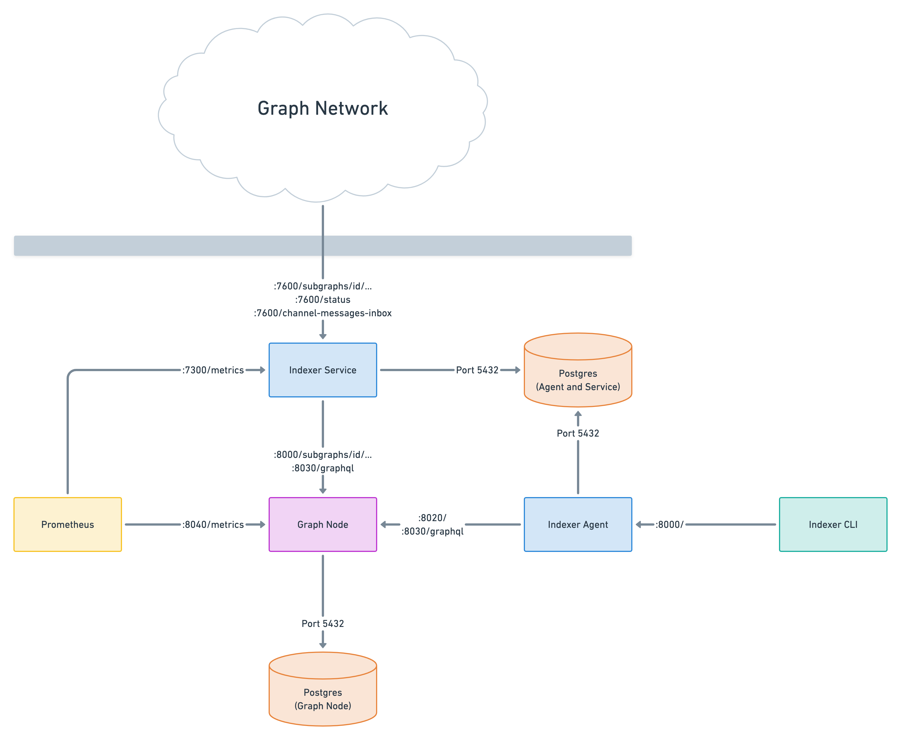

# Indexer Infrastructure Ports

## Ports Overview

The following ports are being used by all components by default. Also listed are
the CLI flags and environment variables that can be used to change the ports.

### Graphical Overview

### Graph Node

| Port | Purpose                                    | Routes                                             | CLI argument        | Environment variable |
| ---- | ------------------------------------------ | -------------------------------------------------- | ------------------- | -------------------- |
| 8000 | GraphQL HTTP server (for subgraph queries) | `/subgraphs/id/...`   `subgraphs/name/.../...` | `--http-port`       | -                    |
| 8001 | GraphQL WS (for subgraph subscriptions)    | `/subgraphs/id/...`   `subgraphs/name/.../...` | `--ws-port`         | -                    |
| 8020 | JSON-RPC (for managing deployments)        | `/`                                                | `--admin-port`      | -                    |
| 8030 | Subgraph indexing status API               | `/graphql`                                         | `--index-node-port` | -                    |
| 8040 | Prometheus metrics                         | `/metrics`                                         | `--metrics-port`    | -                    |

### Indexer Service

| Port | Purpose                                         | Routes                                                              | CLI argument | Environment variable   |
| ---- | ----------------------------------------------- | ------------------------------------------------------------------- | ------------ | ---------------------- |
| 7600 | GraphQL HTTP server (for paid subgraph queries) | `/subgraphs/id/...`   `/status`   `/channel-messages-inbox` | `--port`     | `INDEXER_SERVICE_PORT` |
| 7300 | Prometheus metrics                              | `/metrics`                                                          | -            | -                      |

### Indexer Agent

| Port | Purpose                                      | Routes | CLI argument                | Environment variable                    |
| ---- | -------------------------------------------- | ------ | --------------------------- | --------------------------------------- |
| 8000 | Indexer management API (for `graph indexer`) | `/`    | `--indexer-management-port` | `INDEXER_AGENT_INDEXER_MANAGEMENT_PORT` |