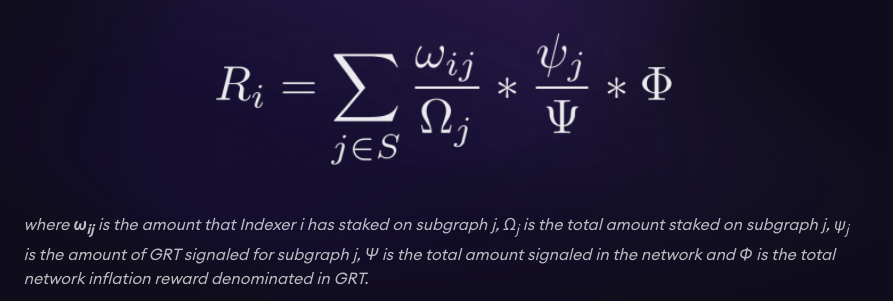
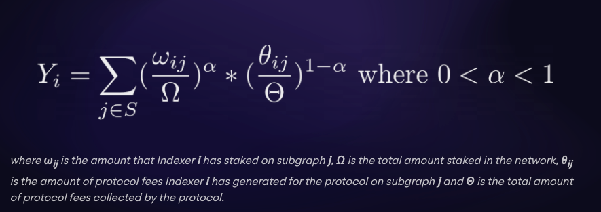
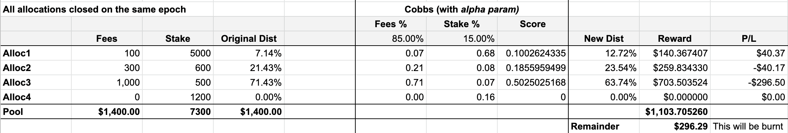

# Indexer Economics for the Testnet
We have presented documentation and videos in the past that have explained how the
economics in the protocol work. The best reference for this would be the
[Indexer Kickoff videos](https://www.youtube.com/channel/UCAzO0qviMMiEdq90B90pvGQ), as well as the 
[Curator Kickoff call](https://www.youtube.com/watch?v=sM8XBg8YkP8&feature=youtu.be&t=900).
The link for the Curator Kick Off call starts right at the economics talk for your convenience.

This document is a simple recap of the economics. The intent of this folder to give this simple
recap in writing, as well as provide a source of truth for the different parameterization and 
actions that will be unique to each phase.

# Recap on Protocol Economics
One of the best resources for the economics is
[this blog](https://thegraph.com/blog/the-graph-network-in-depth-part-2), as well as the videos
shared above.

Here we will have a short recap on the protocol economics, focused on the ways that profit can be made
in the protocol during the testnet.

## Inflation Rewards
The inflation rewards refer to the minting of GRT to incentivize Indexers to index subgraphs.
The formula can be seen below:

The basic things to grasp are:
- Subgraphs with more signal will receive more inflation rewards
- The Indexer with more stake on that subgraph will receive a larger portion of the rewards that
  the subgraph will receive
- Inflation is paid by minting new tokens when an allocation is closed

An important parameter in the testnet is the `network GRT issuance` (a.k.a inflation rate).
In the testnet so far we have used 3%, and it should stay *around* this value.

An Indexer should be paying attention to the subgraphs with the most signal, as well as the ones
with the most queries, in order to maximize their return in both indexing rewards and query rebates.
All while factoring in whatever the `network GRT issuance` is set to.

We will get into queries next.

## Query Fee Rebates
Queries are paid for in GRT off chain in a state channels. These state channels then send
the GRT on chain. When Allocations are closed out, these query fees get aggregated into a single pool
for each epoch. The Rebate Formula (a.k.a Cobbs-Douglas Formula) is shown below:

The formula is a bit complex. Let's add some more detail on how it works within The Graph:
- The time period is always a length of one epoch.
- The calculation for each subgraph restarts on each epoch.
- An Allocation can last across many epochs, loosely enforced by the `maxAllocationEpochs` parameter.
- When an Allocation is closed, you must wait at least `channelDisputeEpochs` epochs before you can claim the 
  query fee rebate. This is known as "Settling" .Query fees will be added into the pool for the epoch
  that the allocation was closed in.
    - Note that during this time, if that Allocation is still receiving query fees, they will be
      added to the pool in which the Allocation was closed, not the next epoch.
- The query fees can be claimed after the `channelDisputeEpochs` time is up.

When you examine the formula, you will notice that you can actually **receive a smaller query fee**
**rebate than the query fees you collected**, as well as a larger amount than you collected.
This is shown with an example in the screen shot below:

Make sure as a Indexer that you understand how the above formula works. You should
ensure you are maximizing your indexing rewards and query fee rebates. (Feel free to build your own
spreadsheet for the Rebate Formula. It will help with the intuition of the formula).

## Curation Bonding Curves
The curation bonding curves have already been explained in the Curator Kickoff video linked above.
 We have included below some other references for those that want a deeper understanding:

- [A high level write up on Bancors bonding curves](https://medium.com/@billyrennekamp/converting-between-bancor-and-bonding-curve-price-formulas-9c11309062f5)
- [A more mathematical write up on Bancors bonding curve](https://blog.relevant.community/bonding-curves-in-depth-intuition-parametrization-d3905a681e0a)
- [A calculator with bancor parameters](https://www.desmos.com/calculator/pvxwmt9stf). Where:
  - `k` = the reserve ratio
  - `b` = the underlying token balance (in our case, GRT)
  - `s` = the supply of the curve token (in our case, the Curation Shares)
  - Together, `b` and `s` influence the slope, `m`.
  - And `d` is just added in for illustrative purposes, to show how much the price will increase
    in order to purchase `d` shares.

As an Indexer, you should understand how to make a profit by signaling on a bonding curve. You
should also understand the risks associated with this, often known as being "rug pulled".

The Graph will deploy all subgraphs for each phase. It is the job of the Indexers to decide which
subgraphs are most likely to be useful, and receive queries. It is then also their job to monitor
the actual queries being sent, when The Graph starts to send queries to each subgraph.

## Recap on Savings Rate Contract (Testnet only)
The savings rate is something that we added into the testnet to give the option of moving your
capital outside of the protocol. We are looking to simulate the fact that in the real world, there
are many other investment opportunities, and an Indexer could find a better return with their
capital, and exit their capital from The Graph.

During the testnet, you should be able to calculate your expected APR from staking, curating, and query
fees. If you ever notice that the savings rate goes above this, it would be rational for you to move
your money into the savings contract, and get a better return on investment.

You can [deposit in the savings contract here](https://testnet.thegraph.com/savings/).

## Other Ways to Make Profit (Delegation & Subgraph Developers)
Delegators can make profit by delegating to Indexers. Right now there are no plans to do this in
the incentivized testnet. We will make an announcement if anything changes.

Subgraph Developers are incentivized by creating subgraphs, and being the first curator on that
subgraph. In the testnet, The Graph deploys all of the subgraphs for the Indexers to Index.

In the real network, some discovery will have to be done between Indexers and the community of Subgraph
Developers. But this won't have to be considered during the testnet.

# General Suggestions and Summary
As an Indexer in the incentivized testnet you should be paying attention to the following:

- How to maximize inflation rewards
- How to maximize query fee rebates
- How to identify bonding curves that are under signaled, and provide signal to these subgraphs
- Recognize at any time if the savings rate is more profitable than your basic strategy and move
  your GRT into the savings contract

With this is mind, an Indexer might build out a model of the economics, with inputs for the
parameters in the protocol. As the parameters get changed, either during a single phase, or across
different phases, the Indexer could update their model, and adjust their strategy. You should be
able to look at the economics, and confidently know you have put your GRT in the right place to
maximize your return. You can watch for parameter changes in the Network Subgraph, and update
your model accordingly. Sometimes we will also announce when we are making parameter changes in
the Discord announcements for Indexers. Sometimes we will not

Please read the other files in this folder, in order to find parameters for each phase, and
what to expect to happen for each phase.