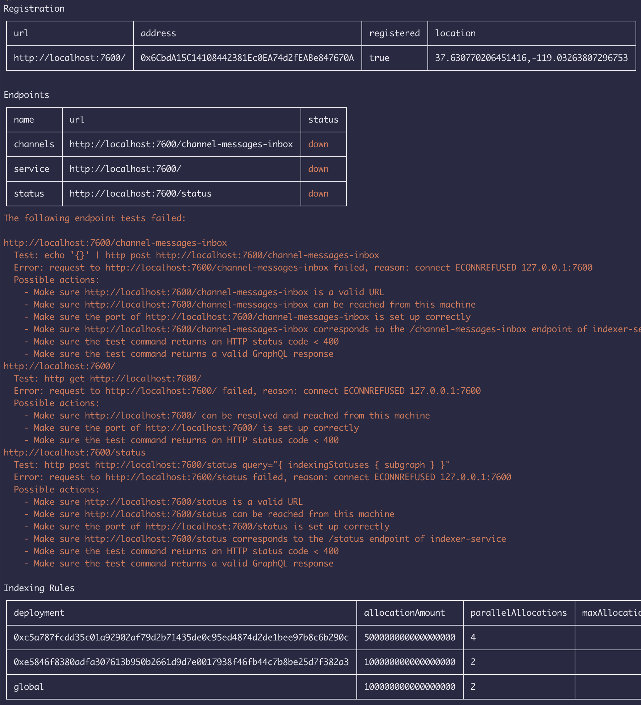

# 2020-08-27 Indexer CLI Status Improvements

## What's in this release?

There is a new `@graphprotocol/indexer-cli` release that provides detailed
status reports for indexer endpoints, with possible actions to take to
resolve the problems.

This also requires updating the Indexer Agent.



## How to update

1. Install the latest version of `@graphprotocol/indexer-cli` with NPM:
   ```sh
   # Make sure you are logged in to https://testnet.thegraph.com/npm-registry/
   # and that this is your default registry
   npm install -g @graphprotocol/indexer-cli
   ```

2. Install the latest version of `@graphprotocol/indexer-agent`:

   NPM:
   ```sh
   # Install the latest
   npm install -g @graphprotocol/indexer-agent

   # Optional:
   npm install -g @graphprotocol/indexer-service

   # Install specific versions:
   npm install -g @graphprotocol/indexer-agent@0.2.3
   npm install -g @graphprotocol/indexer-service@0.2.3
   ```

   Docker:
   ```sh
   docker pull graphprotocol/indexer-agent:sha-54d4905

   # Optional, but can't hurt:
   docker pull graphprotocol/indexer-service:sha-54d4905
   ```

3. Restart at least the Indexer Agent.

4. Run `graph indexer status` to get a more detailed report for your
   endpoints.